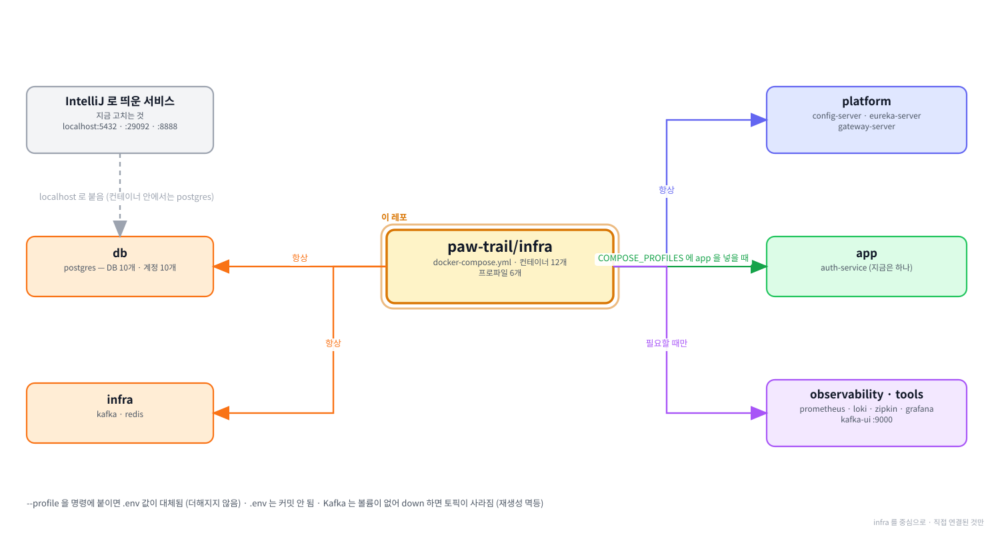

# infra

**함께하개의 로컬 개발 환경입니다.** DB · 메시지 큐 · 플랫폼 서비스를 컨테이너로
한 번에 띄웁니다.

---

**먼저 전체 그림을 보고, 이 레포가 그 안 어디에 있는지 본 뒤 읽습니다.**

**① 전체 구조 — 층으로 본 것.** 위에서 아래로 요청이 내려가고, 어느 층에 무엇이 있는지.


**② 전체 구조 — 서비스끼리 무엇을 주고받는지.** 초록 실선이 `/internal` 호출, Kafka 표가 이벤트, 하늘색 점선이 VPC 경계.


**③ 이 레포를 중심으로.** 직접 연결된 것만 남긴 그림.



> ①② 는 `service-template/docs` 에 있는 것을 가리킵니다. 서비스가 늘어도 그쪽 한 곳만 고칩니다.

<br><br>

---

## 본문 시작

```
[ 내 컴퓨터 ]

  IntelliJ 로 띄우는 것            지금 고치고 있는 서비스
        │                          localhost 로 아래에 붙음
        ▼
  Docker 네트워크 (pawtrail)
  │
  ├── db             postgres                    DB 10개 · 계정 10개
  │
  ├── infra          kafka · redis               *거의 항상 켜 둠
  │
  ├── platform       config-server   8888        설정을 내려 줌
  │                  eureka-server   8761        주소 장부
  │                  gateway-server  8080        모든 요청의 입구
  │
  ├── app            auth-service    8081        개발이 끝난 도메인 서비스
  │                                              (나머지 13개는 아직)
  │
  ├── tools          kafka-ui        9000        토픽·메시지 보기
  │
  └── observability  prometheus 9090 · loki 3100      필요할 때만
                     zipkin 9411 · grafana 3000
```

<br><br>

---

## 0. 이 저장소가 하는 일

**서비스를 하나 개발하려면 그 뒤에 여러 개가 필요합니다.**

| 만들려는 것 | 필요한 것 |
|---|---|
| `place-service` | PostgreSQL · Kafka · Redis · config-server · eureka-server · gateway-server |
| 그것들을 각자 설치하면 | **버전이 갈리고 "제 컴퓨터에서는 되는데" 가 생김** |
| 여기서 띄우면 | **명령 한 줄. 누구 컴퓨터에서든 같은 버전** |

---

**숫자로 보면 이렇습니다.**

| | 값 | 어디에 |
|---|---|---|
| 컨테이너 | **12개** | [1-1](#1-1-무엇이-들어-있나) |
| 프로파일 | 6개 | [3장](#3-프로파일--무엇을-띄울지-고르기) |
| DB | 10개 | [4-2](#4-2-데이터베이스-10개) |
| Kafka 토픽 | 12개 | [4-3](#4-3-kafka-토픽-12개) |
| 코드 | **없음** | compose · 셸 스크립트 · 설정 파일만 |

---

**파일이 이게 전부입니다.**

```
paw-trail/infra
│
├── docker-compose.yml              컨테이너 12개
├── .env                            ⛔커밋 안 됨. 각자 만듦
├── .env.example                    그 목록과 설명
│
├── init-db/
│   ├── 01-databases.sh             DB 10개 · 계정 10개 · 권한
│   └── 02-extensions.sh            PostGIS · pg_trgm
│
├── kafka/create-topics.sh          토픽 12개
├── prometheus/prometheus.yml       수집 대상
└── grafana/provisioning/           데이터소스 자동 등록
```

<br><br>

---

### 먼저 알아 두면 좋은 것 4가지

**Docker 를 써 본 적이 없어도 이 네 가지만 알면 됩니다.**

---

**① 컨테이너란 — 설치 없이 프로그램을 띄우는 방법**

```
직접 설치하면                          컨테이너로 띄우면

  PostgreSQL 설치 프로그램 받기          docker compose up -d
  설치 · 설정 · 서비스 등록                    │
  Kafka 도 · Redis 도 · ...                  └── 정해진 이미지를 받아 그대로 띄움
        │                                        내 컴퓨터에 아무것도 설치 안 됨
        └── 사람마다 버전이 갈림                    지우면 흔적 없이 사라짐
            "제 컴퓨터에서는 되는데"
```

**이미지**는 설치가 끝난 상태를 통째로 찍어 둔 것이고, **컨테이너**는 그 이미지를 띄운 것입니다.
`postgis/postgis:17-3.5` 처럼 **버전이 이름에 박혀 있어 누구 컴퓨터든 같습니다.**

---

**② `docker compose` 란 — 여러 컨테이너를 한 파일로**

```
docker run postgres ...        컨테이너 하나를 손으로
docker run kafka ...
docker run redis ...
        │
        ▼
docker-compose.yml             12개를 파일 하나에 적어 두고
docker compose up -d           한 번에 띄움
                  ▲
                  └── -d : 백그라운드로. 안 붙이면 터미널이 로그에 묶임
```

| 명령 | 뜻 |
|---|---|
| `up -d` | 띄움 (백그라운드) |
| `down` | 내림 |
| `ps` | 상태 보기 |
| `logs -f <이름>` | 로그 보기 (`-f` 는 계속 따라감) |
| `exec <이름> <명령>` | 컨테이너 안에서 명령 실행 |

---

**③ "프로파일" 이 둘 있습니다 — 서로 다른 것입니다**

| | Compose 프로파일 | 스프링 프로파일 |
|---|---|---|
| 무엇 | **어느 컨테이너를 띄울지** 고르는 태그 | 서비스가 **어디서 도는지** 알리는 이름 |
| 값 | `db` · `infra` · `platform` · `app` … | `local` · `dev` · `prod` |
| 어디에 | `.env` 의 `COMPOSE_PROFILES` | 컨테이너의 `SPRING_PROFILES_ACTIVE` |
| 이 문서에서 | **[3장](#3-프로파일--무엇을-띄울지-고르기) 전체** | 컨테이너는 전부 `dev` |

**이 문서에서 "프로파일" 이라고만 쓰면 Compose 프로파일입니다.**

---

**④ 여기 뜨는 것들이 무엇인가**

| 컨테이너 | 한 줄로 | 우리 서비스가 쓰는 곳 |
|---|---|---|
| **PostgreSQL** | 데이터베이스 | 계정 · 장소 · 후기 … 전부 |
| **Kafka** | 우체통. 서비스끼리 직접 부르지 않고 편지를 남김 | `account.created` 같은 이벤트 |
| **Redis** | 빠른 메모장. 잠깐 두는 값 | 리프레시 토큰 · 인증 코드 |
| **config-server** | 설정을 나눠 주는 곳 | 모든 서비스가 기동할 때 |
| **eureka-server** | 주소 장부 | 게이트웨이가 서비스를 찾을 때 |
| **gateway-server** | 모든 요청의 입구 | 브라우저가 부르는 유일한 포트 |
| Kafka UI | Kafka 안을 들여다보는 화면 | 토픽에 메시지가 실렸는지 |
| Prometheus · Grafana | 지표 수집 · 화면 | 요청 수 · 응답 시간 |
| Loki | 로그 모아 두는 곳 | 서비스 로그 검색 |
| Zipkin | 요청 하나가 서비스 몇 개를 지났나 | 느린 화면 원인 찾기 |

<br><br>

---

### 이 문서를 읽는 순서

| 지금 하려는 일 | 볼 곳 |
|---|---|
| 처음 세팅한다 | [1장](#1-처음-한-번) → [2장](#2-최초-실행) |
| 무엇을 띄울지 고르고 싶다 | [3장](#3-프로파일--무엇을-띄울지-고르기) |
| 포트·DB·토픽이 뭐가 있는지 | [4장](#4-구성-요소) |
| 자주 쓰는 명령 | [5장](#5-자주-쓰는-명령) |
| IntelliJ 로 서비스를 띄우려 한다 | [6장](#6-서비스를-붙일-때) |
| 플랫폼 이미지를 다시 굽는다 | [7장](#7-이미지-만들어-올리기) |
| 뭔가 안 된다 | [8장](#8-막히기-쉬운-자리) |
| Windows · macOS 차이 | [9장](#9-환경별-주의사항) |
| 모르는 말이 나온다 | [11장](#11-용어) |

<br><br>

---

## 1. 처음 한 번

<br><br>

---

### 1-1. 무엇이 들어 있나

| 프로파일 | 컨테이너 | 포트 | 메모리 | 언제 켜나 |
|---|---|---|---|---|
| `db` | postgres | 5432 | 1g | **항상** |
| `infra` | kafka | 9092 · 29092 | 1g | **항상** |
| | redis | 6379 | 256m | **항상** |
| `platform` | config-server | 8888 | 512m | **항상** |
| | eureka-server | 8761 | 512m | **항상** |
| | gateway-server | 8080 | 512m | **항상** |
| `app` | auth-service | 8081 | 640m | auth 를 안 고칠 때 |
| `tools` | kafka-ui | **9000** | 512m | 토픽을 볼 때 |
| `observability` | prometheus | 9090 | 512m | 지표를 볼 때 |
| | loki | 3100 | 512m | |
| | zipkin | 9411 | 512m | |
| | grafana | 3000 | 512m | |

> **Kafka UI 가 9000 인 이유** — 원래 8080 인데 **게이트웨이와 겹칩니다.**

<br><br>

---

### 1-2. Docker Desktop

**메모리를 4GB 이상 줍니다.**

```
Settings → Resources → Memory
```

| 조합 | 대략 |
|---|---|
| `infra,platform,db,tools` | 약 4.2G |
| `+ app` (auth) | 약 4.8G |
| `+ observability` | 약 6.8G |

> **16GB 머신이면 관측 스택은 필요할 때만 켭니다.**
> macOS 4.5G + 컨테이너 + Docker VM 0.5G 를 대략 잡으면 그렇습니다.

<br><br>

---

### 1-3. 클론

```bash
git clone https://github.com/paw-trail/infra.git
cd infra
```

> **셸 스크립트가 있어 줄바꿈이 중요합니다.** `.gitattributes` 가 `.sh` 를 LF 로
> 강제하므로 Windows 에서 클론해도 정상입니다. **직접 만든 `.sh` 를 넣을 때는
> 편집기 우하단이 LF 인지 확인합니다** — CRLF 면 컨테이너 안에서
> `\r: command not found` 가 납니다.

<br><br>

---

## 2. 최초 실행

```
① .env.example 을 복사해 .env 를 만들고 값을 채움
        │      POSTGRES_PASSWORD · SERVICE_DB_PASSWORD · GRAFANA_PASSWORD
        │      app 을 켤 거면 AUTH_ 값 3개도
        ▼
② docker compose config --services        오타 검사. 서비스 목록이 나오면 정상
        │
        ▼
③ docker compose up -d                    .env 의 COMPOSE_PROFILES 조합대로
        │
        ├──▶  postgres 가 처음 뜰 때 init-db 스크립트가 돎
        │       DB 10개 · 계정 10개 · PostGIS · pg_trgm
        │
        ▼
④ docker compose ps                       전부 (healthy) 인지
        │
        ▼
⑤ kafka/create-topics.sh                  토픽 12개. 멱등이라 여러 번 실행해도 됨
        │
        ▼
⑥ 확인   localhost:8761 · localhost:9000
```

<br><br>

---

### 2-1. `.env` 만들기

**macOS**

```bash
cp .env.example .env
```

**Windows (PowerShell)**

```powershell
copy .env.example .env
```

**채워야 하는 값입니다.**

| 이름 | 값 | 필수 |
|---|---|---|
| `COMPOSE_PROFILES` | `infra,platform,db,tools` | ✓ |
| `POSTGRES_USER` | `pawtrail` | ✓ |
| `POSTGRES_PASSWORD` | 아무 값 | ✓ |
| `SERVICE_DB_PASSWORD` | 아무 값 — **서비스 계정 10개가 공유** | ✓ |
| `GRAFANA_USER` · `GRAFANA_PASSWORD` | 아무 값 | ✓ |
| `AUTH_JWT_PRIVATE_KEY_B64` | 팀장에게 받음 | `app` 켤 때만 |
| `AUTH_MAIL_PASSWORD` | 팀장에게 받음 | `app` 켤 때만 |
| `AUTH_OAUTH_GOOGLE_CLIENT_SECRET` | 팀장에게 받음 | `app` 켤 때만 |

> ⛔ **`.env` 는 커밋되지 않습니다.** `.gitignore` 에 있습니다.
> **비밀값을 `.env.example` 에 적지 않습니다.**
>
> **`SERVICE_DB_PASSWORD` 를 나중에 바꾸려면 DB 를 다시 만들어야 합니다.**
> init 스크립트는 **볼륨이 비어 있을 때만** 돌기 때문입니다.

<br><br>

---

### 2-2. 설정 검사

```bash
docker compose config --services
```

**서비스 목록이 나오면 정상입니다.**

| 결과 | 뜻 |
|---|---|
| 목록이 나옴 | YAML 과 `.env` 가 정상 |
| `services: {}` | **`COMPOSE_PROFILES` 가 비었거나 오타** |
| YAML 오류 | 들여쓰기 문제 |

<br><br>

---

### 2-3. 기동

```bash
docker compose pull
docker compose up -d
docker compose ps
```

> **`pull` 을 먼저 합니다.** `up -d` 는 **이미지가 없을 때만** 내려받고,
> 이미 갖고 있으면 낡았더라도 그대로 씁니다. 플랫폼과 도메인 서비스 이미지는
> 다른 사람이 고쳐 다시 올리므로 **내 컴퓨터의 사본이 조용히 뒤처집니다.**
>
> 처음 받을 때는 없던 이미지라 `up -d` 만으로도 같지만, **습관으로 붙여 둡니다.**

**`STATUS` 가 전부 `(healthy)` 가 될 때까지 40초쯤 걸립니다.**

```
NAME                  STATUS                    PORTS
pawtrail-postgres     Up 40 seconds (healthy)   0.0.0.0:5432->5432/tcp
pawtrail-kafka        Up 40 seconds (healthy)   0.0.0.0:9092->9092/tcp, 0.0.0.0:29092->29092/tcp
pawtrail-redis        Up 40 seconds (healthy)   0.0.0.0:6379->6379/tcp
...
```

> **`(health: starting)` 은 아직 확인 중이라는 뜻입니다.** 기다립니다.

---

**postgres 가 처음 뜰 때 init 스크립트가 돕니다.**

```
[init-db] creating auth_db / auth_svc
[init-db] creating user_db / user_svc
...
[init-db] done: 10 databases
```

```bash
docker compose logs postgres | grep init-db
```

<br><br>

---

### 2-4. Kafka 토픽 만들기

**컨테이너 안에서 실행합니다.**

```bash
docker compose exec kafka bash /opt/scripts/create-topics.sh
```

**토픽 12개가 만들어집니다.** 스크립트가 멱등이라 **여러 번 실행해도 안전합니다.**

> **자동 생성을 꺼 두었습니다.** 켜 두면 **컨슈머의 토픽명 오타가 조용히 빈 토픽을
> 만들어 "발행은 되는데 소비만 안 되는" 상태**가 됩니다.

<br><br>

---

### 2-5. 확인

| 주소 | 무엇 |
|---|---|
| `http://localhost:8761` | 유레카 대시보드 — 플랫폼이 등록됐는지 |
| `http://localhost:9000` | Kafka UI — 토픽 12개 |
| `http://localhost:8888/place-service/local` | 설정이 내려오는지 |
| `http://localhost:3000` | Grafana (`observability` 를 켰다면) |

<br><br>

---

## 3. 프로파일 — 무엇을 띄울지 고르기

**모든 컨테이너에 `profiles:` 가 붙어 있습니다.** 켠 프로파일에 해당하는 것만 뜹니다.

```
.env
  COMPOSE_PROFILES=infra,platform,db,tools


docker compose up -d
        │
        └──▶  .env 의 조합이 뜸           ✅ 평소에 이렇게 씀


docker compose --profile app up -d
        │
        └──▶  ⛔ .env 값이 통째로 대체됨
                활성 프로파일이 app 하나
                        │
                        └── auth 의 depends_on 이 가리키는
                            config-server · postgres 가 프로젝트에 없음
                              service "auth-service" depends on undefined service
                              → invalid compose project


한 번만 다르게 띄우려면 전부 나열
  docker compose --profile infra --profile platform --profile db --profile tools --profile app up -d
```

<br><br>

---

### 3-1. 상황별 조합

| 상황 | `COMPOSE_PROFILES` |
|---|---|
| **auth 를 고치는 중** | `infra,platform,db,tools` |
| **auth 를 컨테이너로 띄움** | `infra,platform,db,tools,app` |
| 대시보드·추적을 볼 때 | 위 조합 + `,observability` |
| 수집 배치를 돌릴 때 | 위 조합 + `,pipeline` — ⚠**아직 compose 에 없음** |

> **`.env` 는 사람마다 다른 파일입니다.** 각자 자기 방식대로 두면 됩니다.
> auth 를 고치지 않는 팀원은 `app` 을 넣어 두는 편이 편합니다.
>
> ⚠ **`app` 을 켤 때는 IntelliJ 의 auth 를 먼저 멈춥니다.** 8081 이 겹칩니다.

<br><br>

---

### 3-2. `down` 도 프로파일을 봅니다

```bash
docker compose down
```

**활성 프로파일에 없는 컨테이너는 안 내려갑니다.**

```
.env 에 db 가 없는데 --profile db 로 postgres 를 띄웠다면
        │
        └── docker compose down 이 그것을 대상으로 안 잡음
              Resource is still in use 로 네트워크 삭제도 실패
```

**해결**

```bash
docker compose --profile db down
# 또는
docker rm -f pawtrail-postgres
```

<br><br>

---

## 4. 구성 요소

<br><br>

---

### 4-1. 포트

```
8080  gateway-server     *모든 API 요청의 입구
8081  auth-service        직접 확인할 때만
8761  eureka-server       대시보드
8888  config-server       설정
9000  kafka-ui            *8080 이 아님 (게이트웨이와 겹침)
9090  prometheus
3000  grafana
3100  loki
9411  zipkin
5432  postgres
6379  redis
9092  kafka               컨테이너끼리
29092 kafka               *호스트에서 붙을 때
```

---

**Kafka 포트가 둘인 이유입니다.**

```
컨테이너 안에서   kafka:9092          같은 도커 네트워크
호스트에서       localhost:29092      IntelliJ 로 띄운 서비스
```

**한 브로커인데 리스너가 둘입니다.** config 의 `application-local.yml` 은 29092 를,
`application-dev.yml` 은 9092 를 씁니다.

---

**도메인 서비스 포트 배정입니다.**

| 포트 | 서비스 |
|---|---|
| 8081 | auth |
| 8082 | user |
| 8083 | pet |
| 8084 | place |
| 8085 | policy |
| 8086 | verdict |
| 8087 | search |
| 8088 | ingest |
| 8089 | extract |
| 8090 | congestion |
| 8091 | route |
| 8092 | report |
| 8093 | notification |
| 8094 | review |
| 8095 | template (검증용) |

<br><br>

---

### 4-2. 데이터베이스 10개

```
postgres 컨테이너 하나
│
├── auth_db      auth_svc          user_db    user_svc
├── pet_db       pet_svc           place_db   place_svc
├── policy_db    policy_svc        search_db  search_svc
├── raw_db       ingest_svc        report_db  report_svc
└── review_db    review_svc        notif_db   notif_svc
```

**계정이 자기 DB 에만 붙을 수 있습니다.**

```sql
REVOKE CONNECT ON DATABASE ${db} FROM PUBLIC;
GRANT ALL PRIVILEGES ON DATABASE ${db} TO ${role};
```

```
PostgreSQL 은 기본적으로 PUBLIC 에 CONNECT 를 줌
        │
        └── 이 줄이 없으면 auth_svc 가 place_db 에 그냥 접속됨
              *Database per Service 를 문서가 아니라 권한으로 강제하는 자리
```

**확인**

```bash
docker compose exec postgres psql -U pawtrail -c "\l"
```

---

**DB 가 없는 서비스도 있습니다.**

```
verdict · congestion · route     무상태
extract                          raw_db 를 읽고 policy 에 넘김 (자기 DB 없음)
```

---

**PostGIS 와 pg_trgm 이 깔립니다.**

| 확장 | 왜 |
|---|---|
| `postgis` | 좌표 · 거리 검색 (place · search · route) |
| `pg_trgm` | 오타·부분일치 검색 |

> **PostGIS 는 신뢰 확장이 아니라 `CREATE EXTENSION` 에 슈퍼유저가 필요합니다.**
> 그래서 init 스크립트가 만듭니다.

<br><br>

---

### 4-3. Kafka 토픽 12개

```
도메인 이벤트 6개 + 각각의 .dlq

place.updated          place    ──▶  search
policy.changed         policy   ──▶  notification · verdict
pet.profile.updated    pet      ──▶  verdict
account.created        auth     ──▶  user
account.withdrawn      auth     ──▶  user · pet · report · review · notification
report.resolved        report   ──▶  notification
```

---

**`.dlq` 는 재시도가 끝난 메시지가 가는 곳입니다.**

```
컨슈머가 실패
        │
        └── 1초 → 2초 → 4초 로 3회 재시도
                    │
                    └── 그래도 실패하면 {원본토픽}.dlq 로 보내고 넘어감
                          *그 메시지 하나 때문에 뒤가 막히지 않게
```

**DLQ 조회 API 를 만들지 않았습니다.** Kafka UI(9000)로 봅니다.

---

**토픽 자동 생성을 껐습니다.**

```
켜 두면
        │
        └── 컨슈머의 토픽명 오타가 조용히 빈 토픽을 만듦
              발행은 되는데 소비만 안 되는 상태
```

<br><br>

---

### 4-4. 관측 스택

```
서비스  ──▶  Loki 3100         로그
       ──▶  Zipkin 9411       추적 (요청 하나가 서비스 몇 개를 지났나)
       ◀──  Prometheus 9090   지표 (긁어 감)
                    │
                    ▼
              Grafana 3000    셋을 한 화면에
```

**Grafana 데이터소스는 자동 등록됩니다.**

```
grafana/provisioning/datasources/datasources.yml
        │
        └── Prometheus · Loki · Zipkin 셋이 기동할 때 붙음
              * Connections 메뉴에서 손으로 추가할 필요 없음
```

---

**Prometheus 타깃을 추가할 때입니다.**

```yaml
# prometheus/prometheus.yml
- targets: ["host.docker.internal:8084"]
  labels:
    application: place-service        # *블록째 추가
```

> ⚠ **`metrics_path` 를 빠뜨리면 조용히 아무것도 안 모입니다.**
> 기존 블록을 복사해 값만 바꾸는 편이 안전합니다.
>
> **추적은 게이트웨이에서 시작됩니다.** 서비스를 8084 로 직접 부르면
> Zipkin 에서 전체 경로를 못 봅니다.

<br><br>

---

### 4-5. 데이터가 남는 것과 안 남는 것

| | 볼륨 | `down` 하면 |
|---|---|---|
| **postgres** | `postgres_data` | **남습니다** |
| kafka | 없음 | **사라집니다** |
| redis | 없음 | 사라집니다 |
| prometheus · loki · grafana | 없음 | 사라집니다 |

```
Kafka 는 일부러 볼륨을 안 잡음
        │
        └── apache/kafka 이미지가 비루트로 도는데
              이미지에 없는 경로에 빈 볼륨을 마운트하면
              그 디렉터리가 root 소유로 생겨 브로커가 못 씀
                    │
                    └── 토픽 생성 스크립트가 멱등이라 재실행 한 번이면 복구됨
```

---

**DB 를 완전히 비우려면**

```bash
docker compose --profile db down -v
docker compose up -d
```

**`-v` 가 볼륨을 지웁니다.** 그러면 init 스크립트가 다시 돌아 **DB 10개가 새로
만들어집니다.**

<br><br>

---

## 5. 자주 쓰는 명령

```bash
# 기동 · 중지
docker compose up -d
docker compose down                    # 볼륨은 남음
docker compose --profile db down -v    # ⚠DB 까지 지움

# 상태
docker compose ps
docker compose logs -f auth-service
docker compose logs postgres | grep init-db

# 이미지 갱신 — up -d 만으로는 안 받음
docker compose pull auth-service      # 하나만
docker compose pull                   # 켜 둔 것 전부
docker compose up -d

# 토픽 재생성 (멱등)
docker compose exec kafka bash /opt/scripts/create-topics.sh

# DB 접속
docker compose exec postgres psql -U auth_svc -d auth_db -P pager=off

# Redis
docker compose exec redis redis-cli KEYS '*'
```

> **`-P pager=off`** 가 없으면 결과가 넓을 때 **멈춘 것처럼 보입니다.**
>
> **`docker compose restart <서비스>`** 는 컨테이너만 다시 시작합니다.
> **이미지를 바꾸려면 `pull` + `up -d`** 입니다.

<br><br>

---

## 6. 서비스를 붙일 때

**IntelliJ 로 서비스를 띄우려면 세 가지가 필요합니다.**

```
① 컨테이너가 떠 있음                 docker compose up -d
        │
② IntelliJ 실행 구성에 환경변수
        │
③ config 저장소에 그 서비스 파일       <서비스명>.yml
        │
        ▼
   기동
        │
        └──▶  *게이트웨이로 부르려면 라우트도 열어야 함
                안 열면 서비스는 정상인데 404
```

<br><br>

---

### 6-1. IntelliJ 실행 구성에 넣는 환경변수

```
Run → Edit Configurations → Environment variables
```

| 이름 | 값 | 누가 |
|---|---|---|
| `DB_HOST` | `localhost` | DB 를 쓰는 서비스 |
| `SERVICE_DB_PASSWORD` | `.env` 와 같은 값 | 같음 |
| `AUTH_JWT_PRIVATE_KEY_B64` | 팀장에게 받음 | auth 만 |
| `AUTH_MAIL_PASSWORD` | 팀장에게 받음 | auth 만 |
| `AUTH_OAUTH_GOOGLE_CLIENT_SECRET` | 팀장에게 받음 | auth 만 |

```
DB_HOST=localhost;SERVICE_DB_PASSWORD=...
```

> ⚠ **`.env` 는 Docker Compose 가 읽는 파일이라 IntelliJ 와 무관합니다.**
> 같은 값을 두 곳에 넣게 되는데, 한 곳만 관리하고 싶으면 **OS 환경변수**에 둡니다.
> 대신 터미널·IntelliJ 재시작이 필요합니다.

---

**`DB_HOST` 가 컨테이너와 다릅니다.**

```
IntelliJ (호스트에서 돎)     localhost:5432
컨테이너 (도커 안에서 돎)     postgres:5432
        │
        └── *같은 postgres 컨테이너인데 부르는 이름만 다름
              컨테이너 안에서 localhost 는 자기 자신이라 DB 가 없음
```

**컨테이너 쪽은 compose 에 박혀 있어 아무도 안 건드려도 됩니다.**

---

**빠뜨렸을 때 나오는 오류입니다.**

| 빠진 것 | 증상 |
|---|---|
| `DB_HOST` | `UnknownHostException: ${DB_HOST}` — **치환이 안 돼 문자열 그대로 들어감** |
| `SERVICE_DB_PASSWORD` | `password authentication failed for user "auth_svc"` |
| | **계정이 없으면 `role does not exist`** 이므로 이 메시지는 비밀번호 문제 |

> **빌드는 환경변수 없이도 통과합니다.** Testcontainers 가 자기 DB 를 띄우기 때문에
> **실제로 띄울 때가 되어서야 드러납니다.**

<br><br>

---

### 6-2. 게이트웨이를 거쳐 호출하기

**세 가지가 다 되어야 합니다.**

```
① 서비스가 유레카에 등록됐나          localhost:8761 에 보이는지
② config 에 <서비스명>.yml 이 있나     포트가 8080 으로 뜨면 없는 것
③ *게이트웨이 라우트가 열려 있나       ← 제일 빠지기 쉬움
```

**③을 빠뜨리면 서비스는 정상인데 404 입니다.**

```bash
curl http://localhost:8080/actuator/gateway/routes
```

**여는 법은 `config` README 5-2 에 있습니다.**

---

**IntelliJ 로 띄운 서비스도 게이트웨이가 찾아냅니다.**

```
local 프로파일   →  host.docker.internal 로 유레카에 등록
                          │
                          └── 그 이름이 컨테이너 안에서도 호스트를 가리킴
                                게이트웨이가 IntelliJ 서비스를 호출할 수 있음
```

<br><br>

---

### 6-3. 로컬 DB 를 쓰는 이유

**EC2 PostgreSQL 을 아직 세우지 않았습니다.**

```
auth · user · pet 은 공유할 데이터가 없음
        │
        └── 오히려 공유하면 서로의 테스트 계정이 섞여 성가심

EC2 가 필요해지는 것은 ingest 착수 시점
        │
        └── 수집 데이터 4,600건을 공유해야 하고
              공공 API 쿼터가 하루 1,000건이라 각자 채울 수 없음
```

> ⚠ **DB 를 공유하면 위험합니다.** 한쪽이 Flyway 스크립트를 추가하면
> **공유 DB 에 즉시 적용되어 다른 쪽 스키마가 모르는 사이에 바뀝니다.**

<br><br>

---

## 7. 이미지 만들어 올리기

**플랫폼·도메인 서비스의 코드를 고쳤을 때만 합니다.**

```
① 서비스 저장소에서 빌드
        ./gradlew clean build
        │
        ▼
② ghcr 로그인                기기당 한 번
        │
        ▼
③ docker buildx build --platform linux/amd64,linux/arm64 --push
        │
        ▼
④ 팀원은  docker compose pull && docker compose up -d
```

<br><br>

---

### 7-1. 처음 한 번

**Windows (PowerShell)**

```powershell
$env:GPR_TOKEN | docker login ghcr.io -u <GitHub 아이디> --password-stdin
```

**macOS**

```bash
echo $GPR_TOKEN | docker login ghcr.io -u <GitHub 아이디> --password-stdin
```

> 환경변수에 토큰이 없으면 값을 직접 넣어도 됩니다. 다만 **셸 이력에 남습니다.**

| 걸리는 것 | 증상 |
|---|---|
| 윈도우 계정명을 씀 | `denied: denied` — **GitHub 아이디여야 함** |
| 토큰에 `write:packages` 가 없음 | 같음 |

> **자격증명은 Docker Desktop 이 기억하므로 기기당 한 번입니다.**
>
> **조직명이 `pawtrail` 이 아니라 `paw-trail`** 입니다. 자바 패키지와 갈려 있습니다.

<br><br>

---

### 7-2. 굽고 올리기

**Windows (PowerShell)**

```powershell
cd C:\Tour_Prj\<서비스>
.\gradlew clean build

docker buildx build --platform linux/amd64,linux/arm64 `
  -t ghcr.io/paw-trail/<서비스>:latest --push .
```

**macOS**

```bash
cd ~/<서비스>
./gradlew clean build

docker buildx build --platform linux/amd64,linux/arm64 \
  -t ghcr.io/paw-trail/<서비스>:latest --push .
```

> **줄 이어 쓰기 문자가 다릅니다.** PowerShell 은 백틱, macOS 는 역슬래시입니다.
> 한 줄로 쓰면 둘 다 그 문자가 필요 없습니다.

**`buildx` 로 두 아키텍처를 함께 굽습니다.** 굽는 기기가 무엇이든 결과가 같습니다.

| 걸리는 것 | 왜 |
|---|---|
| `--push` 를 빼면 아무것도 안 남음 | 여러 아키텍처를 담은 이미지는 **로컬 저장소에 넣을 수 없습니다.** `--load` 는 한 아키텍처만 가능하고, 둘 다 빼면 굽기만 하고 버립니다 |
| `multiple platforms feature is currently not supported` | 빌더를 한 번 만들어야 합니다 (아래) |

```powershell
docker buildx create --name multiarch --driver docker-container --use --bootstrap
```

> **왜 두 아키텍처를 다 굽는가**
>
> 배포 서버는 x86 이고 팀원 중에 Apple Silicon 맥이 있습니다. 한쪽만 담으면
> **다른 쪽에서 `no matching manifest for linux/arm64/v8` 로 컨테이너가 아예 뜨지 않습니다.**
>
> 부담은 거의 없습니다. Dockerfile 에 `RUN` 이 하나도 없고 jar 를 복사하는 것뿐이라
> 다른 아키텍처를 흉내내어 명령을 실행할 일이 없습니다. 두 레이어가 각각 1초 안에 끝납니다.

**확인 — 아키텍처**

```powershell
docker buildx imagetools inspect ghcr.io/paw-trail/<서비스>:latest
```

`linux/amd64` 와 `linux/arm64` 가 **둘 다** 나와야 합니다.

```
MediaType: application/vnd.oci.image.index.v1+json

  Platform:    linux/amd64
  Platform:    linux/arm64
  Platform:    unknown/unknown      ← 빌드 증명, 정상입니다
  Platform:    unknown/unknown
```

> **`MediaType` 이 `image.index` 여야 합니다.** `image.manifest` 하나만 나오면
> 아키텍처가 하나뿐인 이미지이며, 다른 아키텍처에서는 내려받지 못합니다.
>
> `unknown/unknown` 두 줄은 각 아키텍처의 빌드 증명입니다. 실행에 관여하지 않습니다.

**확인 — 내용물**

```powershell
docker run --rm --entrypoint sh ghcr.io/paw-trail/<서비스>:latest -c "ls -lh /app"
```

`app.jar` 가 수십 MB 면 정상입니다. **몇 KB 면 `-plain.jar` 가 담긴 것**인데
`build.gradle` 에 `tasks.named('jar') { enabled = false }` 가 있어 지금은 안 생깁니다.

> ⚠ **`docker run <이미지> ls` 는 동작하지 않습니다.** `ENTRYPOINT` 가 있으면
> 뒤 명령이 인자로 붙습니다. `--entrypoint sh` 가 필요합니다.

<br><br>

---

### 7-3. 처음 올린 뒤 공개로 바꿉니다

**컨테이너 이미지는 기본이 비공개라 팀원이 못 받습니다.**

```
GitHub 조직 → Packages → 해당 패키지 → Package settings
        │
        └── Change visibility → Public
```

> ⚠ **회색으로 막혀 있으면** 조직 정책입니다.
> **조직 Settings → Packages 에서 `Public` 을 허용**하면 풀립니다.
>
> **Maven 패키지(공통 모듈)는 레포 공개 여부를 따라가고 컨테이너 이미지만
> 이 정책을 따로 받습니다.**

<br><br>

---

### 7-4. 두 아키텍처를 굽는 부담이 거의 없습니다

```
 => [linux/arm64 3/3] COPY build/libs/*.jar app.jar          0.8s
 => [linux/amd64 3/3] COPY build/libs/*.jar app.jar          0.8s
 => exporting to image                                      16.6s
 => => exporting manifest list sha256:de2f7230...             0.0s
 => => pushing layers                                        9.4s
```

**아키텍처별 레이어가 각각 1초 안에 끝납니다.** `Dockerfile` 이 jar 를 복사하는
것뿐이라 다른 아키텍처를 흉내내어 명령을 실행할 일이 없습니다.

> **`exporting manifest list` 가 나와야 멀티아치입니다.** 이 줄이 없으면
> 아키텍처가 하나뿐인 이미지입니다.

**베이스 이미지가 같아 실제로 올라가는 것은 우리 jar 하나뿐입니다.** 같은 층은
다시 올리지 않고 다른 저장소의 것을 가져다 씁니다.

<br><br>

---

## 8. 막히기 쉬운 자리

<br><br>

---

### 8-1. 컨테이너가 안 뜰 때

| 증상 | 원인 |
|---|---|
| `docker compose config` 가 `services: {}` | **`COMPOSE_PROFILES` 가 비었거나 오타** |
| `depends on undefined service` | **`--profile` 이 `.env` 를 대체함.** [3장](#3-프로파일--무엇을-띄울지-고르기) |
| `variable is not set` 경고 | `.env` 에 그 값이 없음 |
| `network ... not found` | 이전 `down` 이 덜 끝남 → `docker compose down` 후 다시 |
| `up -d` 가 `Starting` 에서 멈춤 | Docker Desktop 이 먹통 — 아래 |
| `ports are not available ... forbidden` | **윈도우 예약 포트** — 아래 |
| `no matching manifest for linux/arm64/v8` | **이미지에 그 아키텍처가 없음** — 아래 |

---

**Docker Desktop 이 먹통일 때 (Windows)**

```powershell
# 1. Ctrl+C 로 중단
# 2. WSL 을 내림
wsl --shutdown
# 3. 그래도 멈춰 있으면
Get-Process "*docker*" | Stop-Process -Force
# 4. Docker Desktop 다시 실행
```

---

**윈도우 예약 포트 (Windows)**

```
Hyper-V 가 동적 포트 범위를 잡아 두면 그 안의 포트를 못 씀
```

```powershell
# 확인
netsh int ipv4 show excludedportrange protocol=tcp

# 범위를 위로 옮김 (관리자 권한, 재부팅 필요)
netsh int ipv4 set dynamicport tcp start=49152 num=16384
```

---

**`no matching manifest for linux/arm64/v8` (주로 macOS)**

**이미지에 그 컴퓨터의 아키텍처가 담겨 있지 않다는 뜻입니다.**

```
[+] Running 7/8
 ✘ auth-service    Error context canceled
 ⠹ config-server   Pulling
 ✘ postgres        Error context canceled
 ✘ kafka           Error context canceled
 ...
no matching manifest for linux/arm64/v8 in the manifest list entries
```

> ⚠ **`Error context canceled` 에 속지 않습니다.** 하나가 실패하면 도커가 나머지를
> 전부 취소하면서 붙는 표시입니다. **실제 원인은 마지막 한 줄뿐입니다.**
>
> **`.env` 나 compose 문제가 아닙니다.** 파일은 정상인데 받을 이미지가 없는 것입니다.

| 확인 | |
|---|---|
| 어느 이미지인지 | `docker buildx imagetools inspect ghcr.io/paw-trail/<서비스>:latest` |
| 정상 | `MediaType` 이 `image.index` 이고 `linux/amd64` · `linux/arm64` 가 둘 다 |
| 문제 | `image.manifest` 하나뿐이거나 아키텍처가 하나만 |

**고치는 사람은 그 이미지를 올린 사람입니다.** [7-2](#7-2-굽고-올리기) 의 `buildx`
명령으로 다시 굽습니다. 옛 `docker build` 로 구우면 **구운 기기의 아키텍처 하나만**
담깁니다.

다시 올라온 뒤에는 받는 쪽에서 이렇게 합니다.

```bash
docker compose pull
docker compose up -d
```

> **`pull` 을 먼저 합니다.** `up -d` 만으로는 이미 가진 이미지를 그대로 쓰고,
> 실패한 상태가 남아 있으면 고쳐지지 않습니다.

<br><br>

---

### 8-2. PostgreSQL

| 증상 | 원인 |
|---|---|
| DB 가 안 만들어짐 | **볼륨이 이미 있음.** init 은 **처음 한 번만** 돎 → `down -v` 후 다시 |
| `role does not exist` | 계정이 없음 — 위와 같음 |
| `password authentication failed` | **계정은 있고 비밀번호만 다름.** `SERVICE_DB_PASSWORD` 확인 |
| 비밀번호를 바꿨는데 안 먹음 | 같음. **DB 를 다시 만들어야 함** |
| Flyway `Detected applied migration not resolved locally` | **볼륨에 옛 이력이 남음** → `down -v` |

```bash
docker compose --profile db down -v
docker compose up -d
```

<br><br>

---

### 8-3. Kafka

| 증상 | 원인 |
|---|---|
| `UNKNOWN_TOPIC_OR_PARTITION` 반복 | **토픽을 안 만들었음** → `create-topics.sh` |
| 토픽이 사라짐 | **볼륨이 없어 `down` 하면 사라짐.** 재실행하면 복구 |
| 호스트에서 접속이 안 됨 | **29092** 를 씀. 9092 는 컨테이너끼리 |
| Kafka UI 에서 오프셋 리셋이 안 됨 | 그 컨슈머 그룹이 **활성 상태**. 서비스를 먼저 내릴 것 |

<br><br>

---

### 8-4. 관측 스택

| 증상 | 원인 |
|---|---|
| Grafana 에 Connections 메뉴가 없음 | **프로비저닝으로 이미 등록됨.** Explore 에서 바로 고르면 됨 |
| Prometheus 타깃이 DOWN | 그 서비스가 꺼져 있음. **`connection refused` 면 이름은 풀린 것** |
| 타깃이 `no such host` | 주소 해석 실패 — 이름이 잘못됨 |
| 지표가 안 모임 | **`metrics_path` 를 빠뜨렸음** |
| Loki 에 로그가 없음 | 서비스가 `local` 프로파일이면 **안 보냅니다** (의도) |

```bash
# Loki 가 받고 있는지
curl http://localhost:3100/loki/api/v1/labels
```

**응답에 `data` 필드가 있어야 합니다.**

<br><br>

---

## 9. 환경별 주의사항

<br><br>

---

### 9-1. Windows

| | |
|---|---|
| PowerShell `curl` | `Invoke-WebRequest` 별칭 → **`curl.exe`** |
| 한글 바디 전송 | `-d '{"..."}'` 의 따옴표를 먹음 → **`Set-Content` 로 파일에 쓰고 `-d "@파일"`** |
| 줄바꿈 | `.sh` 는 반드시 **LF**. CRLF 면 `\r: command not found` |
| 예약 포트 | [8-1](#8-1-컨테이너가-안-뜰-때) |
| WSL 메모리 | Docker Desktop 이 WSL2 위에서 돎 |

---

<br><br>

---

### 9-2. macOS (Apple Silicon)

| | |
|---|---|
| 이미지 아키텍처 | **신경 쓰지 않아도 됩니다.** 7-2 절의 `buildx` 명령이 amd64 와 arm64 를 함께 굽습니다 |
| | 어느 기기에서 굽든 결과가 같으므로 맥에서 올려도 배포 서버(x86)에서 돕니다 |
| 메모리 | Docker Desktop 기본이 낮을 수 있음 → 4GB 이상 |

> ⚠ **`postgis/postgis` 는 amd64 만 제공합니다.** `db` 프로파일을 켜면 에뮬레이션으로
> 돌아가며, compose 에 `platform: linux/amd64` 를 명시해 두었으므로 경고가 아니라
> 의도된 동작입니다. 나머지 이미지는 모두 arm64 를 지원합니다.

<br><br>

---

## 10. 아직 안 한 것

| 언제 | 무엇 |
|---|---|
| **도메인 서비스가 완성될 때마다** | compose `app` 프로파일에 추가 (지금 auth 하나) |
| **ingest 착수 시** | EC2 PostgreSQL — 수집 데이터 공유가 필요해짐 |
| **user · pet 이 생기면** | `scripts/seed.sh` — 테스트 데이터 시드 |
| **nginx 를 붙일 때** | `edge` 프로파일 · `nginx.conf` |
| 수집 배치를 만들 때 | `pipeline` 프로파일 |

---

**아직 compose 에 없는 것입니다.**

```
edge       nginx
pipeline   ingest · extract
app        도메인 서비스 13개 (auth 만 있음)
```

**해당 저장소가 완성되고 ghcr 에 이미지가 올라간 뒤에 추가합니다.**

<br><br>

---

## 11. 용어

| 용어 | 뜻 |
|---|---|
| **이미지** | 설치가 끝난 상태를 통째로 찍어 둔 것. `postgis/postgis:17-3.5` |
| **컨테이너** | 이미지를 띄운 것. 프로세스 하나 |
| **볼륨** | 컨테이너를 지워도 남기고 싶은 데이터를 두는 곳. `postgres_data` |
| **네트워크** | 컨테이너끼리 이름으로 서로를 찾는 범위. `pawtrail` |
| **프로파일 (Compose)** | 어느 컨테이너를 띄울지 고르는 태그. `db` · `infra` … |
| **프로파일 (스프링)** | 서비스가 어디서 도는지. `local` · `dev` · `prod`. **위와 다른 것** |
| **`.env`** | Compose 가 읽는 환경변수 파일. 커밋 안 됨 |
| **헬스체크** | 컨테이너가 "정말로 준비됐나" 를 주기적으로 묻는 것. `(healthy)` |
| **`depends_on`** | 다른 컨테이너가 healthy 가 된 뒤에 뜨라는 순서 |
| **`host.docker.internal`** | 컨테이너 안에서 **호스트(내 컴퓨터)** 를 가리키는 이름 |
| **토픽** | Kafka 의 우체통 하나. `account.created` |
| **DLQ** | 재시도가 끝난 메시지가 가는 토픽. `{토픽}.dlq` |
| **멱등** | 여러 번 실행해도 결과가 한 번과 같음. `create-topics.sh` 가 그러함 |
| **init 스크립트** | postgres 가 **처음** 뜰 때 한 번만 도는 셸. DB·계정을 만듦 |
| **PostGIS** | PostgreSQL 에 좌표·거리 계산을 더하는 확장 |
| **pg_trgm** | 오타·부분 일치 검색을 위한 확장 |
| **ghcr** | GitHub 의 컨테이너 이미지 저장소. `ghcr.io/paw-trail/...` |
| **매니페스트 목록** | 아키텍처별 이미지를 묶어 둔 것. 받는 쪽이 자기 아키텍처를 골라 감 |
| **멀티아치 이미지** | 매니페스트 목록을 가진 이미지. `buildx build --platform linux/amd64,linux/arm64` 로 만듦 |
| **레이어** | 이미지를 이루는 층. 같은 층은 다시 올리지 않음 |
